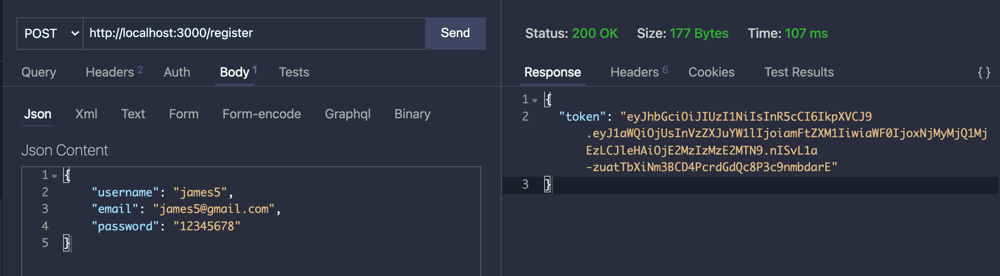
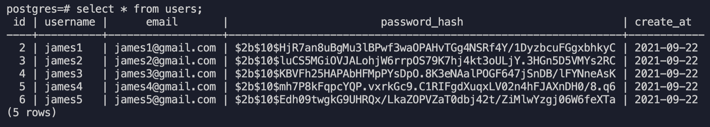
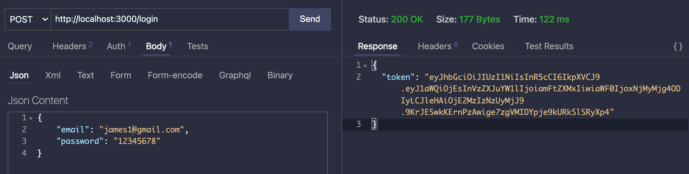
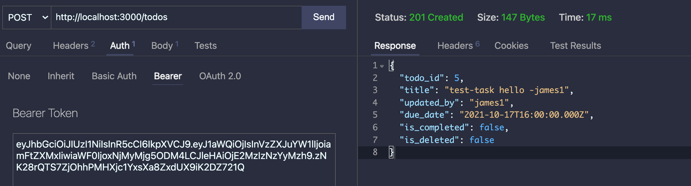
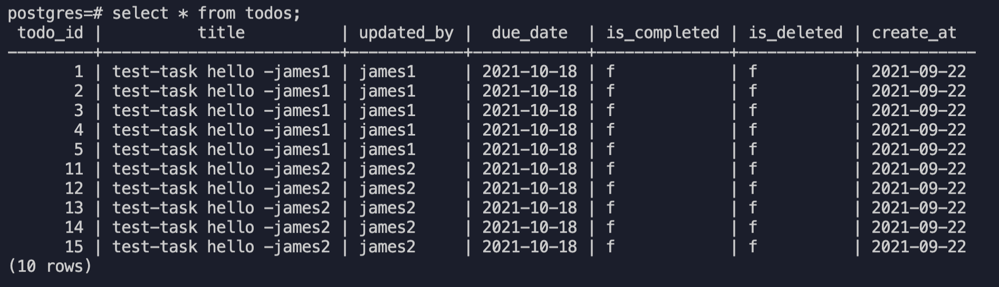

# End-of-Module Final Project for "Backend Developement" course at Singapore University of Technology and Design

Submitted by : James Ee

# Project Description

This is the end-of-module final project for our learning of backend Dev at SUTD. Please see project [requirements](images/project-requirements.pdf).


# Entity Relationship and Schema

The entity relationship chart is shown below: <br><br>


The sql schema is as follows:
```sql
CREATE TABLE IF NOT EXISTS Users (
   id SERIAL         PRIMARY KEY,
   username          VARCHAR(100) NOT NULL,
   email             VARCHAR(50) NOT NULL,
   password_hash     VARCHAR(100) NOT NULL,
   create_at         DATE NOT NULL DEFAULT CURRENT_DATE
)

CREATE TABLE IF NOT EXISTS Todos (
   todo_id           SERIAL PRIMARY KEY,
   title             VARCHAR(128) NOT NULL,
   updated_by        VARCHAR(100) NOT NULL,
   due_date          DATE NOT NULL,
   is_completed      BOOLEAN NOT NULL,
   is_deleted        BOOLEAN NOT NULL,
   create_at         DATE NOT NULL DEFAULT CURRENT_DATE
)

CREATE TABLE IF NOT EXISTS Tasks (
   task_id           SERIAL PRIMARY KEY,
   todo_id           INTEGER NOT NULL,
   title             VARCHAR(128) NOT NULL,
   description       VARCHAR(255) NOT NULL,
   updated_by        VARCHAR(100) NOT NULL,
   due_date          DATE NOT NULL,
   is_completed      BOOLEAN NOT NULL,
   is_deleted        BOOLEAN NOT NULL,
   create_at         DATE NOT NULL DEFAULT CURRENT_DATE,
   FOREIGN KEY (todo_id) REFERENCES Todos(todo_id) ON DELETE CASCADE
)

DROP TYPE IF EXISTS my_roles;
CREATE TYPE my_roles AS ENUM ('creator', 'collaborator', 'read-only');

CREATE TABLE IF NOT EXISTS Access_controls (
   access_id         SERIAL PRIMARY KEY,
   todo_id           INTEGER NOT NULL,
   user_id           INTEGER NOT NULL,
   role              my_roles NOT NULL,
   create_at         DATE NOT NULL DEFAULT CURRENT_DATE,
   FOREIGN KEY (user_id) REFERENCES Users(id) ON DELETE CASCADE,
   FOREIGN KEY (todo_id) REFERENCES Todos(todo_id) ON DELETE CASCADE
)

```

# Project Setup

## Installation

```bash
$ npm install
```
## Usage

### DB migration

```bash
$ npm run db:migrate
```
### Start server
```bash
# for development
$ npm run dev

# for production
$ npm run start
```

## Heroku Deployment

### App Setup

```bash
$ heroku login

$ heroku create backenddev-capstone

# Add Postgres and CloudAMQP add-ons to app
$ heroku addons:create heroku-postgresql:hobby-dev
$ heroku addons:create cloudamqp:lemur

# Set config vars that we need for our app
$ heroku config:set JWT_SECRET=some_secret
$ heroku config:set JWT_EXPIRY=900
$ heroku config:set SALT_ROUNDS=10

```

### Nodejs accessing Heroku postgres add-on with TLS

To access the heroku postgres add-on with TLS using Nodejs, the following settings are required.
```js
// Heroku enviroment
let pool = new Pool({
  connectionString: process.env.DATABASE_URL,
  ssl: {
    require: true,
    rejectUnauthorized: false,
    ca: fs.readFileSync(`${__dirname}/global-bundle.pem`)
  }
})
```

The AWS global-bundle.pem can be downloaded from this [link](https://truststore.pki.rds.amazonaws.com/global/global-bundle.pem)


### Automatic Deployment from GitHub

1. Go to your Heroku app dashboard > `Deploy` tab
2. Under `Deployment method`, select `GitHub` and allow access
3. Search and connect to your GitHub repository
4. Under `Automatic deploys`:
   1. Check `Wait for CI to pass before deploy`
   2. Select `Enable Automatic Deploys`


# Demo

The url of the app is at :
https://backenddev-capstone.herokuapp.com/

At command prompt, 
```bash
# run the app with one web container
$ heroku ps:scale web=1

# a browser will be spun-up with the app url
$ heroku open
```

Swagger documentation can be found at 
https://backenddev-capstone.herokuapp.com/api-docs

## Steps to demostrate the APIs 

**<u>Step 1</u>**
Register 5 accounts using bogus emails (james1@gmail.com,james2@gmail.com, james3@gmail.com,james4@gmail.com,james5@gmail.com )



**<u>Step 2</u>**
Login each account with the email and password to obtain the JWT token for access to api.


**<u>Step 3</u>**
Cut and paste the JWT token of james1 and james2 to the Auth/Bearer of postman/thunder client to create 5 todo lists each using the ***POST /todos*** api respectively:



**<u>Step 4</u>**
To show that user can only access the todos one created, 
   - cut and paste <u>james1's JWT token</u> to the Auth/Brearer and ***GET /todos***
   - cut and paste <u>james2's JWT token</u> to the Auth/Brearer and ***GET /todos***

<p float="left">
  
  
</p>

| James1 | James2 |
|:-------------------------: |:-------------------------: |
|  |  |