# End-of-Module Final Project for "Backend Developement" course at Singapore University of Technology and Design

Submitted by : James Ee

# Project Description

This is the end-of-module final project for our learning of backend Dev at SUTD. Please see project [requirements](images/project-requirements.pdf).


# Entity Relationship and Schema

The entity relationship chart is shown below: <br><br>
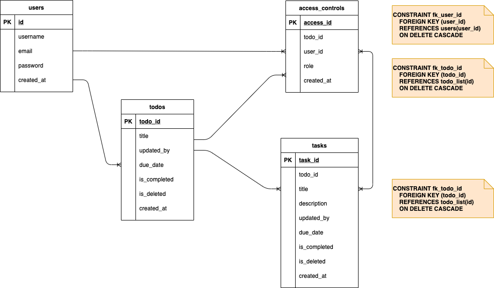

The sql schema is as follows:
```sql
CREATE TABLE IF NOT EXISTS Users (
   id SERIAL         PRIMARY KEY,
   username          VARCHAR(100) NOT NULL,
   email             VARCHAR(50) NOT NULL,
   password_hash     VARCHAR(100) NOT NULL,
   create_at         DATE NOT NULL DEFAULT CURRENT_DATE
)

CREATE TABLE IF NOT EXISTS Todos (
   todo_id           SERIAL PRIMARY KEY,
   title             VARCHAR(128) NOT NULL,
   updated_by        VARCHAR(100) NOT NULL,
   due_date          DATE NOT NULL,
   is_completed      BOOLEAN NOT NULL,
   is_deleted        BOOLEAN NOT NULL,
   create_at         DATE NOT NULL DEFAULT CURRENT_DATE
)

CREATE TABLE IF NOT EXISTS Tasks (
   task_id           SERIAL PRIMARY KEY,
   todo_id           INTEGER NOT NULL,
   title             VARCHAR(128) NOT NULL,
   description       VARCHAR(255) NOT NULL,
   updated_by        VARCHAR(100) NOT NULL,
   due_date          DATE NOT NULL,
   is_completed      BOOLEAN NOT NULL,
   is_deleted        BOOLEAN NOT NULL,
   create_at         DATE NOT NULL DEFAULT CURRENT_DATE,
   FOREIGN KEY (todo_id) REFERENCES Todos(todo_id) ON DELETE CASCADE
)

DROP TYPE IF EXISTS my_roles;
CREATE TYPE my_roles AS ENUM ('creator', 'collaborator', 'read-only');

CREATE TABLE IF NOT EXISTS Access_controls (
   access_id         SERIAL PRIMARY KEY,
   todo_id           INTEGER NOT NULL,
   user_id           INTEGER NOT NULL,
   role              my_roles NOT NULL,
   create_at         DATE NOT NULL DEFAULT CURRENT_DATE,
   FOREIGN KEY (user_id) REFERENCES Users(id) ON DELETE CASCADE,
   FOREIGN KEY (todo_id) REFERENCES Todos(todo_id) ON DELETE CASCADE
)

```

# Project Setup

## Installation

```bash
$ npm install
```
## Usage

### DB migration

```bash
$ npm run db:migrate
```
### Start server
```bash
# for development
$ npm run dev

# for production
$ npm run start
```

## Local Deployment

```bash
# start postgres docker container
$ source backup/postgres-docker.sh

# start rabbitmq docker container
$ source  backup/rabbitMQ-docker.sh
```

## Heroku Deployment

### App Setup

```bash
$ heroku login

$ heroku create backenddev-capstone

# Add Postgres and CloudAMQP add-ons to app
$ heroku addons:create heroku-postgresql:hobby-dev
$ heroku addons:create cloudamqp:lemur

# Set config vars that we need for our app
$ heroku config:set JWT_SECRET=some_secret
$ heroku config:set JWT_EXPIRY=900
$ heroku config:set SALT_ROUNDS=10
$ heroku config:set MYHEROKU="true"
```
Create a "Procfile" at the root directory of project with the followings to instruct heroku how to start the app.

```bash
release: npm run db:migrate
web: npm run start
worker: npm run worker
```

After upload codes to Heroku git repo, ensure that at least one web container and one worker container are running with the following command:
```bash
$ heroku ps:scale web=1 worker=1
```

To access the cloudamqp manager,

```bash
$ heroku addons:open cloudamqp -a backenddev-capstone
```

### Nodejs accessing Heroku postgres add-on with TLS

To access the heroku postgres add-on with TLS using Nodejs, the following settings are required.
```js
// Heroku enviroment
let pool = new Pool({
  connectionString: process.env.DATABASE_URL,
  ssl: {
    require: true,
    rejectUnauthorized: false,
    ca: fs.readFileSync(`${__dirname}/global-bundle.pem`)
  }
})
```

The AWS global-bundle.pem can be downloaded from this [link](https://truststore.pki.rds.amazonaws.com/global/global-bundle.pem)


### Automatic Deployment from GitHub

1. Go to your Heroku app dashboard > `Deploy` tab
2. Under `Deployment method`, select `GitHub` and allow access
3. Search and connect to your GitHub repository
4. Under `Automatic deploys`:
   1. Check `Wait for CI to pass before deploy`
   2. Select `Enable Automatic Deploys`


# Demo

The url of the app is at :
https://backenddev-capstone.herokuapp.com/

At command prompt, 
```bash
# run the app with one web container
$ heroku ps:scale web=1

# a browser will be spun-up with the app url
$ heroku open
```

Swagger documentation can be found at 
https://backenddev-capstone.herokuapp.com/api-docs

## Steps to demostrate the functionalities of the APIs 


**<u>[ Step 1: Register ]</u>**
Register 5 accounts using bogus emails (james1@gmail.com,james2@gmail.com, james3@gmail.com,james4@gmail.com,james5@gmail.com )
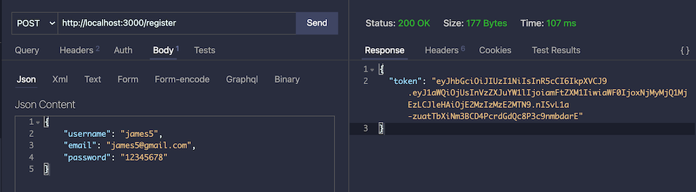
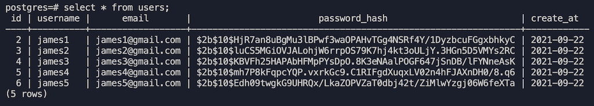

**<u>[ Step 2: Login ]</u>**
Login each account with the email and password to obtain the JWT token for access to api.
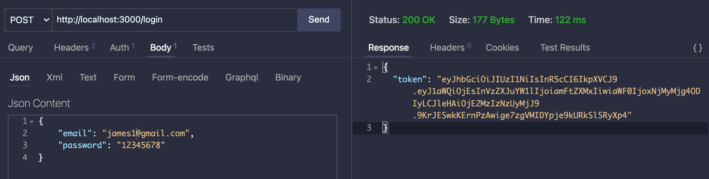

**<u>[Step 3: Create Todo][</u>**
Cut and paste the JWT token of james1 and james2 to the Auth/Bearer of postman/thunder client to create 5 todo lists each using the ***POST /todos*** api respectively:
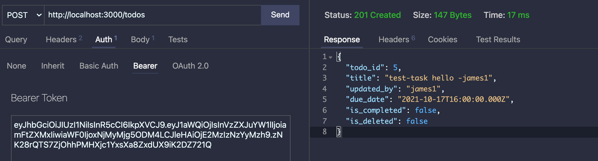
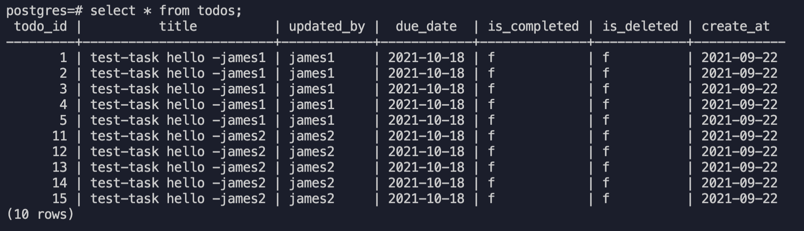
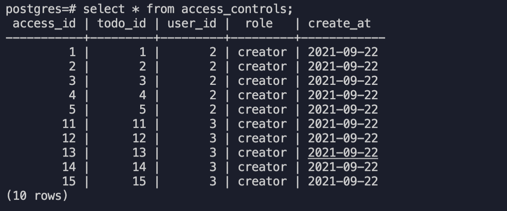


**<u>[ Step 4: Read Todos ]</u>**
To demonstrate that one can only access the todos one created, 
   - cut and paste <u>james1's JWT token</u> to the Auth/Brearer and ***GET /todos***
   - cut and paste <u>james2's JWT token</u> to the Auth/Brearer and ***GET /todos***


| James1 | James2 |
|:-------------------------: |:-------------------------: |
| 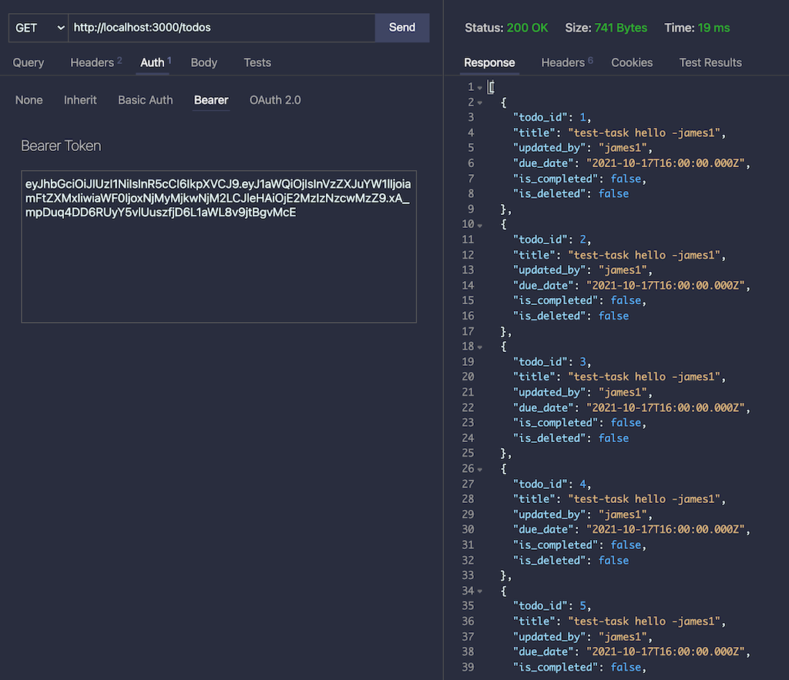 | 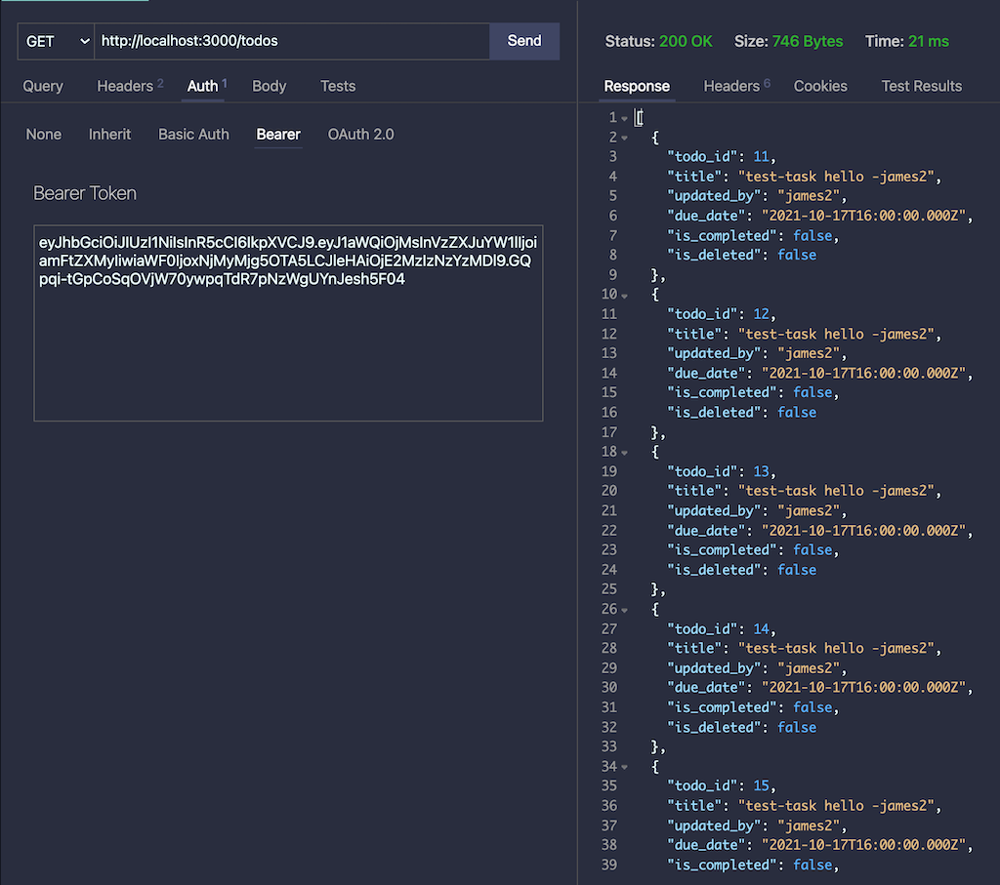 |

**<u>[ Step 5: Update Todo ]</u>**
To demonstrate that one can only update the todos one created, 
- cut and paste <u>james1's JWT token</u> to the Auth/Brearer and  ***PUT /todos/1***
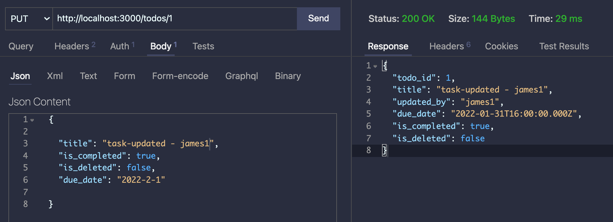
- cut and paste <u>james1's JWT token</u> to the Auth/Brearer and  ***PUT /todos/15***


**<u>[ Step 6: Delete Todo ]</u>**
To demonstrate that one can only delete the todos one created,
- cut and paste <u>james1's JWT token</u> to the Auth/Brearer and  ***DELETE /todos/1***
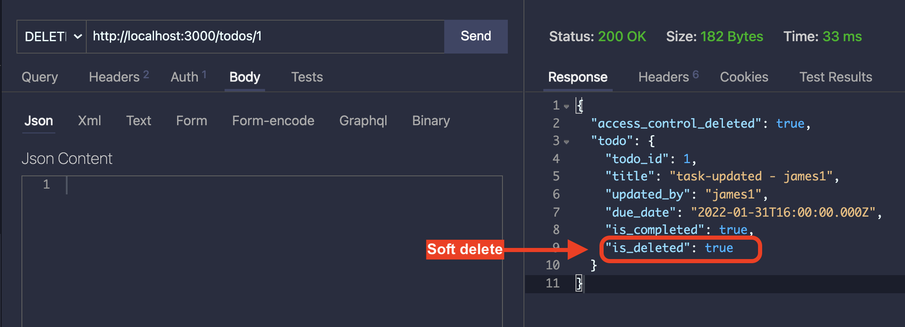
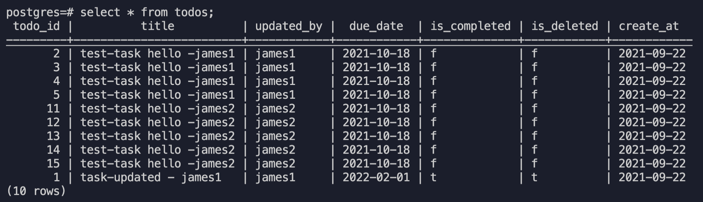
- cut and paste <u>james1's JWT token</u> to the Auth/Brearer and  ***DELETE /todos/15***
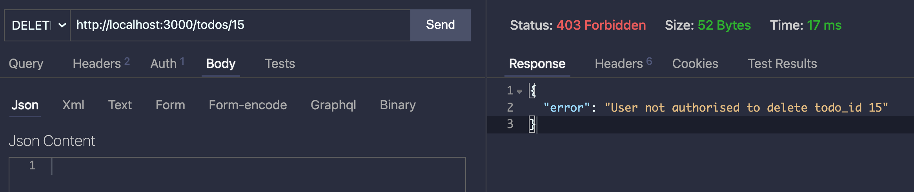

**<u>[ Step 7: Create Tasks ]</u>**
Cut and paste the JWT token of james1 and james2 to the Auth/Bearer of postman/thunder client to create 5 tasks each with todo_id=2 and todo_id=15 respectively using the ***POST /todos/{todo_id}/tasks*** api.

Please note that james2 is not allowed to create task in todo_id=2 because he has no access to todo_id=2.
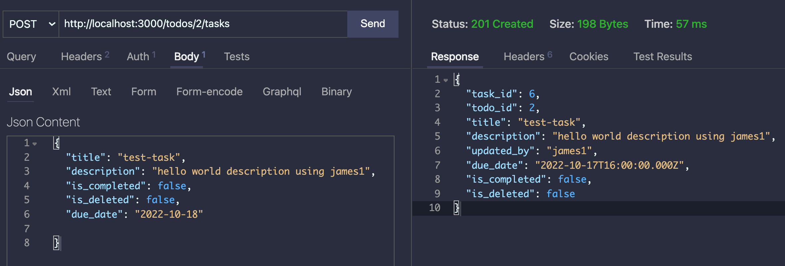
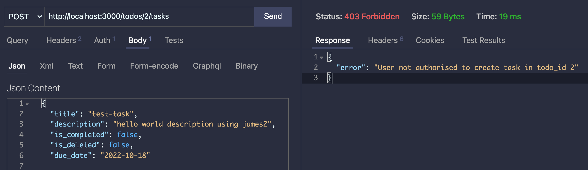
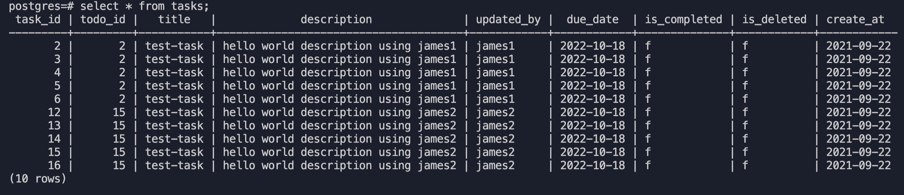

**<u>[ Step 8: Read Tasks ]</u>**
To demonstrate that one can only access the tasks one created, 
   - cut and paste <u>james1's JWT token</u> to the Auth/Brearer and ***GET /tasks***
   - cut and paste <u>james2's JWT token</u> to the Auth/Brearer and ***GET /tasks***

| James1 | James2 |
|:-------------------------: |:-------------------------: |
| 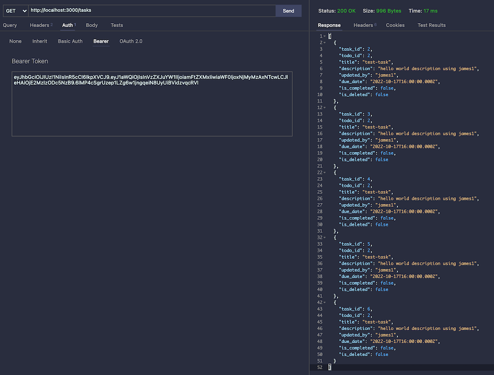 | 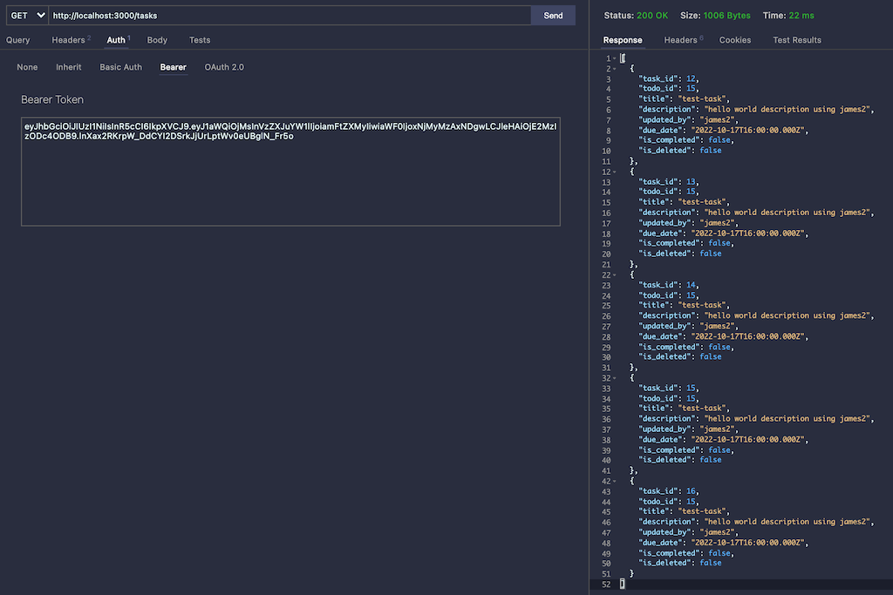 |


**<u>[ Step 9: Update Task ]</u>**
To demonstrate that one can only update the tasks one created, 
- cut and paste <u>james1's JWT token</u> to the Auth/Brearer and  ***PUT /tasks/2***
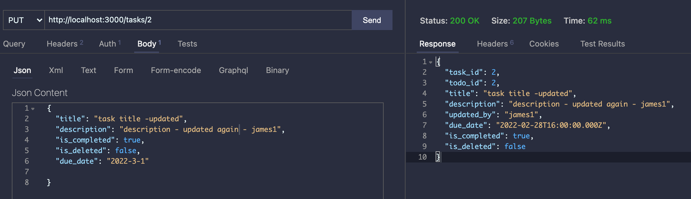
- cut and paste <u>james1's JWT token</u> to the Auth/Brearer and  ***PUT /todos/16***. Please note that James1 has no access to task16.
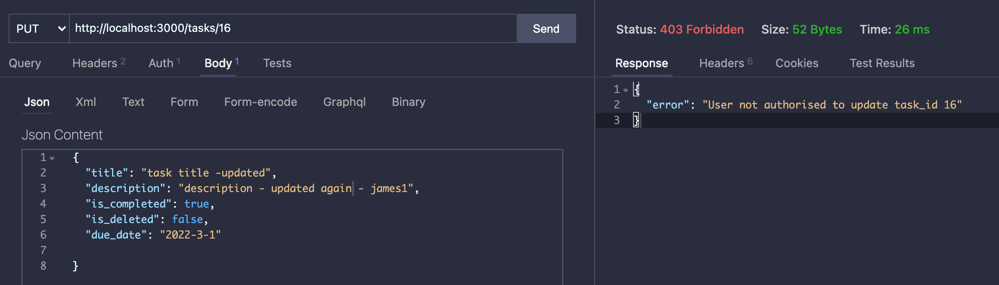

**<u>[ Step 10: Delete Task ]</u>**
To demonstrate that one can only delete the tasks one created,
- cut and paste <u>james1's JWT token</u> to the Auth/Brearer and  ***DELETE /tasks/2***
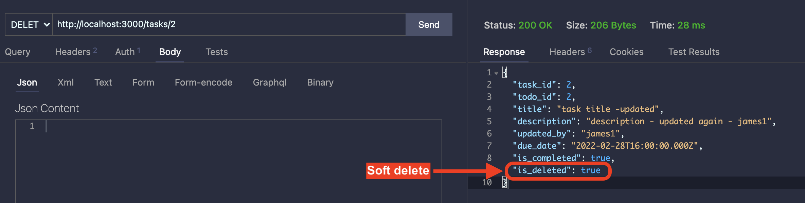
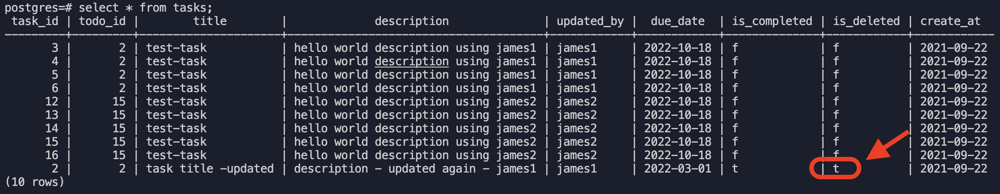
- cut and paste <u>james1's JWT token</u> to the Auth/Brearer and  ***DELETE /todos/15***
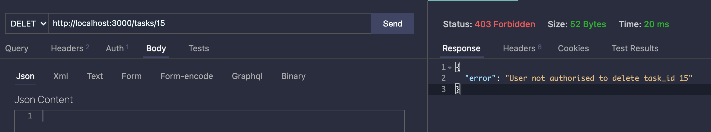


**<u>[ Step 11: Submit sharelist to share todo list ]</u>**
The creator of the todo-list can give access-priviledge to collaborators, who in-turn can invite others to collaborate on the todo-list.
There are 3 roles created, namely "creator", "collaborator" and "read-only". Role "creator" and role "collaborator" have access-rights to edit todo-list, create tasks under the todo-list, and soft delete the todo-list.  Upon soft-delete, the access-rights will be deleted from the AccessControls table of the database. Role "read-only" only has access-rights to read.

To demonstrate the above-mentioned features,
   1. Login as james1@gmail.com and copy the JWT token.
   2. Paste the token in the Auth/Bearer and submit sharelist at ***POST /todos/2/share***. As can be seen below, james2, james3, james4 and james5 are registered into the AccessControls table and have access-rights to todo_id=2.

   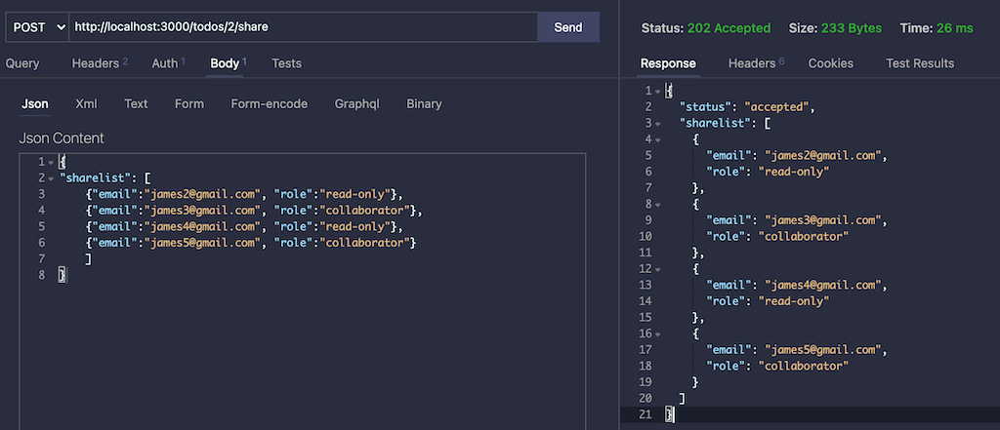
   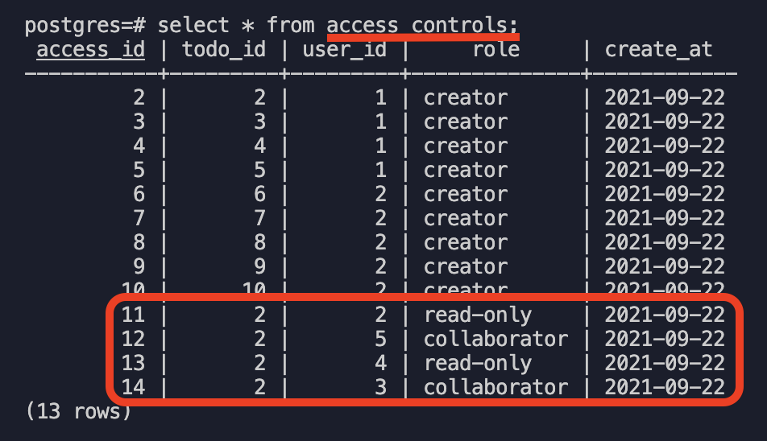

   3.  Now submit the following sharelist. As james6@gmail.com is not a registered user, the submission to share todo_id=2 will be ignored. As for james2 and james5, as both users have been submited in the above (11-2), to avoid duplications of access-priviledge, both will be ignored as well. 
   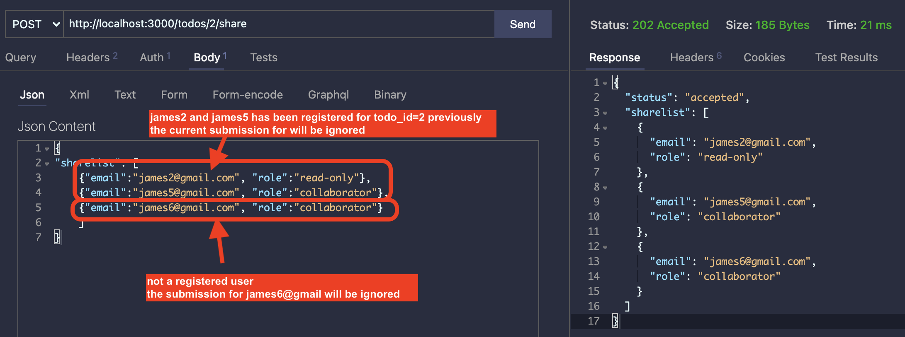

   4. Now login as james5@gmail.com, and update todo_id=2 ***PUT /todos/2*** and task_id=5  ***PUT /tasks/5***. As james5 has been given access to todo_id=2 at above (11-2), james5 now can update todo_id=2 and all the tasks (e.g. task_id=5) under todo_id=2.
   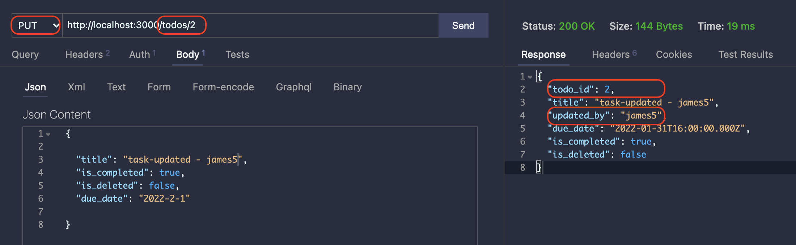
   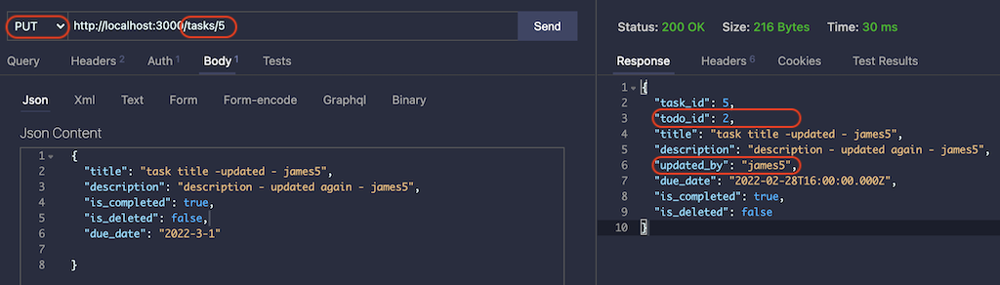

   5. Now we can verify that james5 has access to all tasks under todo_id=2 by using api ***GET /todos*** and ***GET /tasks***.
   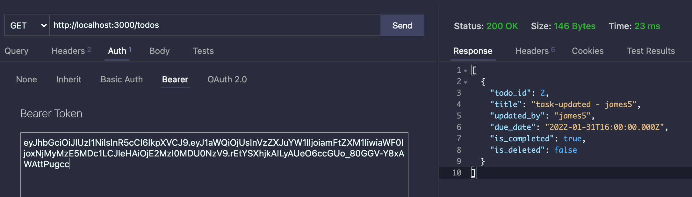
   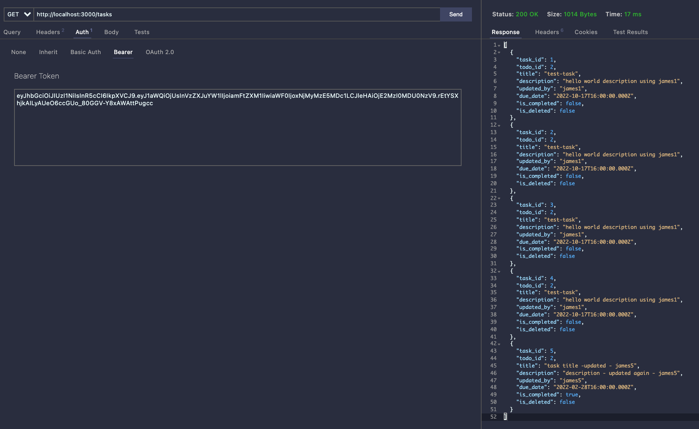
   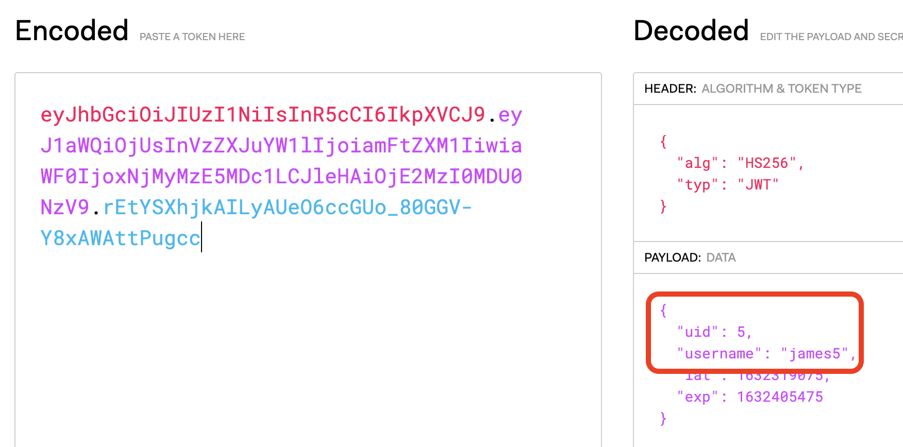